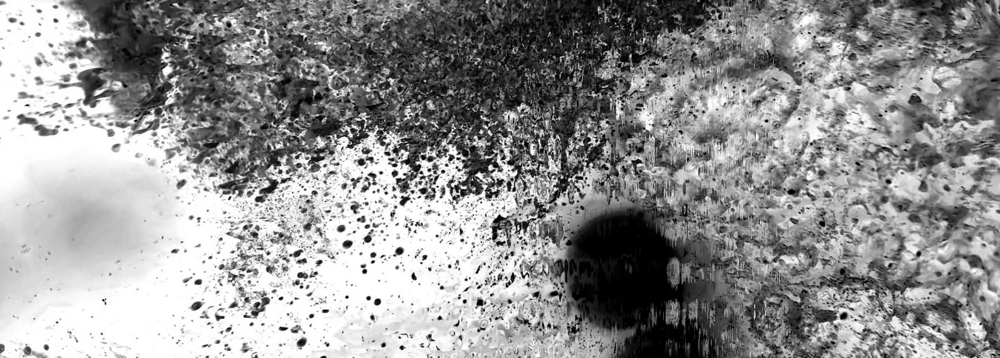

# Código creativo: iluminación interactiva y sistemas de control

En este curso abordaremos el renderizado de gráficos en tiempo real, visualización de iluminación interactiva y sistemas de control.

## Sesiones

- [ ] [Sesión 01](./s01/s01.md) - 06.02.24 - Introducción, discusión y conformación de equipos.

## Enlaces relevantes

- [TouchDesigner](https://derivative.ca/UserGuide/TouchDesigner)

